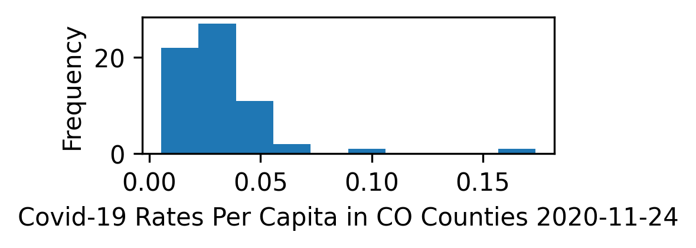
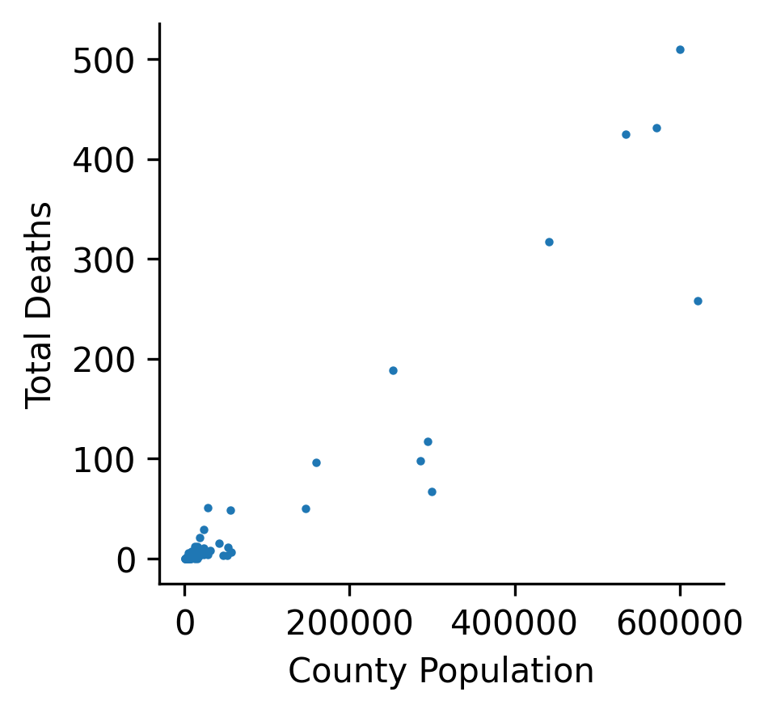

# COVID-19 Cases per County
> This project will plot cases per capita in a county

The file print_cases takes command line arguments for a csv file containing COVID data 
referenced in the submodule as part of this repository, as well as the county column, 
county of interest, and the cases column. The print_cases function calls upon get_columns 
in my_utils.py in order to collect and store data from specified columns per the specified 
county in a list, or list of lists when multiple result columns are given. There are options 
to print the daily cases, rather than cumulative cases, as well as the running average over 
a given window. Files which contain skipped days will be filled in, and those which contain 
out-of order dates will raise an error. Per capita cases can be plotted for each date in
a particular county using the plot_lines function. Plotting functionality is also included. 

## Installation

OS X & Linux:

```sh
git clone https://github.com/cu-swe4s-fall-2020/python-refresher-anmc9115.git
```

## Usage example
`test_print_cases.sh` contains test arguments that are formatted for command line inputs
`run.sh` runs `test_print_cases.sh` and may be run itself with the command: bash run.sh

## Plotting Functionality
### Per Capita Case Distribution Histogram
This histogram can be used to visualize the distribution of case rates per capita 
in all counties of a given state on a certain date.
<center></center>

### Deaths vs Population in Counties
This scatter plot can be used to visualize the correlation between county size and 
number of deaths from covid-19 in the counties of a given state
<center></center>

## Release History

* v1.0
    * ADD: Add `get_column()`
    * ADD: Add `print_cases()`
    * ADD: Add keyword argument for results_column
* v1.1
    * CHANGE: Remove for loop in my_utils
* v2.0
    * ADD: Add command line arguments with argparse
    * CHANGE: `get_column()` returns int array
    * ADD: Add run.sh
    * CHANGE: updated to pep8 style guidelines
    * ADD: Add `main()` in print_cases
* v3.0
    * ADD: `get_daily_count()` in my_utils
    * ADD: `running_average()` in my_utils
    * ADD: `test_my_utils.py` unit tests for my_utils
    * ADD: `test_print_cases.sh` functional test for print_cases
    * CHANGE: update formatting in my_utils and print_cases
* v3.1
   * CHANGE: added missing for loop in random data generation for `test_my_utils.py`
* v4.0
   * ADD: skipped days are filled in in `get_column()` of `my_utils.py`
   * ADD: out of order days raise a ValueError in `get_column()` of `my_utils.py`
   * CHANGE: functional and unit tests updated
   * CHANGE: continuous integration implemented using `.travis.yml`
* v5.0
   * CHANGE: `get_columns()` can return multiple result columns in a list of lists
   * ADD: `binary_search()` to facilitate searching for county name in list
   * ADD: `calc_per_capita()` which uses census data to calculate cases per capita
   * ADD: `plot_lines()` which plots per capita values for each data in a county
   * CHANGE: `print_cases.py` updated for the new functions, and reorganzied 
   * CHANGE: functional and unit tests updated
* v5.1
   * ADD: additional comments in `my_utils`
   * ADD: randomized unit test for `binary_search`
   * CHANGE: making functions in print_cases more consistent
   * ADD: add `file.close()` in `my_utils` when `ValueError` is raised
* v6.0
   * ADD: `hash_table.py` containing `ascii_hash_function`, `put`, and `get`
   * ADD: `get_daily_rates.py` which uses hash tables to print daily rates for
     counties in a certain state
   * CHANGE: functional and unit tests updated
* v7.0
   * ADD: `Snakefile` used for `snakemake` workflow functionality
   * CHANGE: update `get_daily_rates.py` to prepare txt files for plotting
   * ADD: Plotting functionality for daily rate distribution in counties in a state
   * ADD: Plotting functionality for deaths vs population scatter plot in counties 
